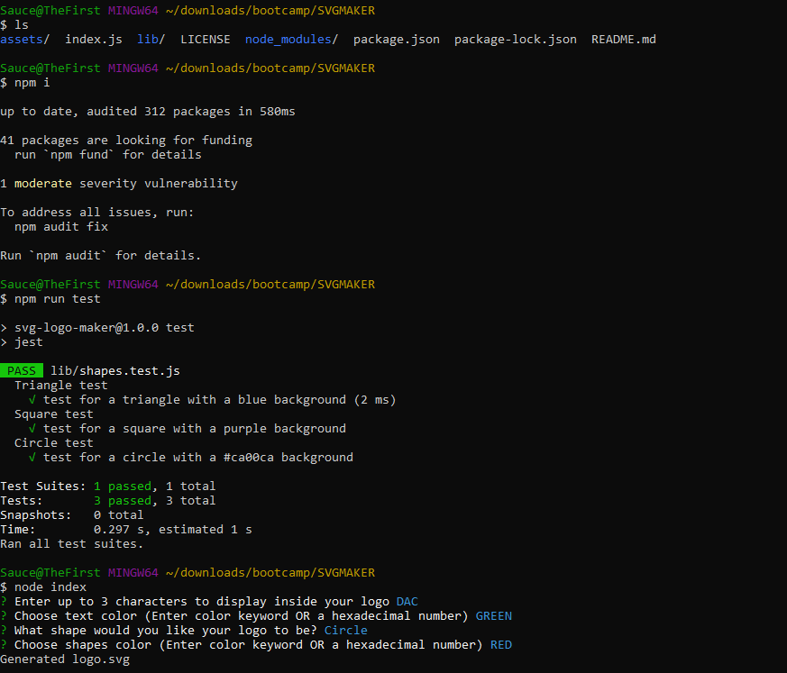

# SVG-Maker
Module 10 Challenge

## Description

This application was created to help developers create simple logos using CLI and node.js. Using the CLI, users can answer a series of prompts and a logo will be generated. 

## Application Functionality Walkthrough

## Screenshots

Logo Generation

Examples of Generated Logos

1[Logo3](./assets/logo-example-3)

## Technologies Used

Node.js v16, 
inquirer v8.2.4 (node package manager)
jest v29.5.0 (node package manager) 

## Installation

1. Clone or download the repo:
   git clone https://github.com/dcanales8/SVG-Maker.git

2. Open in VS Code or your favorite code editor

3. Ensure you have node.js v16 installed 

4. Use the command npm init -y to initialize and create a package.json where project files will be stored.

5. Use you CLI and enter npm i to install the dependencies

6. To run the application, within the terminal, type the command node index.js.

7. To run the test, enter npm run test in your terminal

## License

NOTICE: This application is covered under the MIT License
